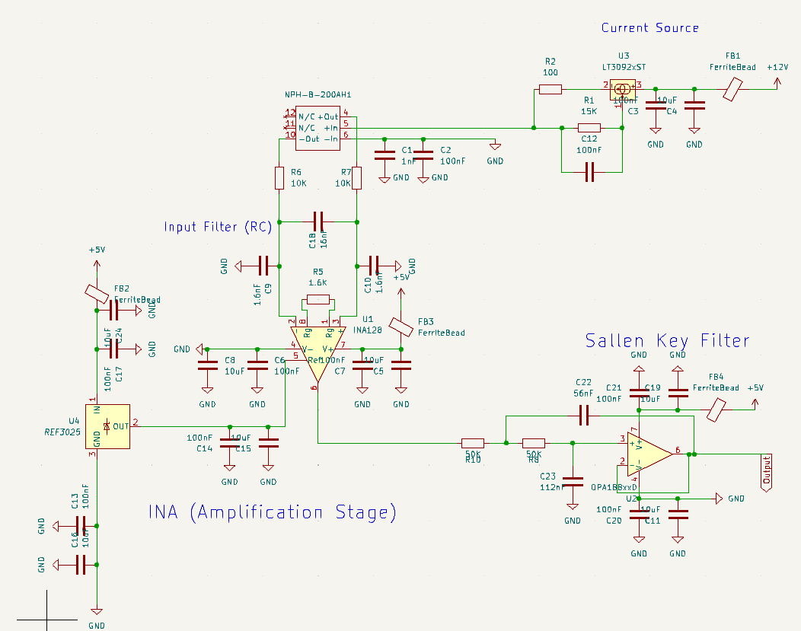
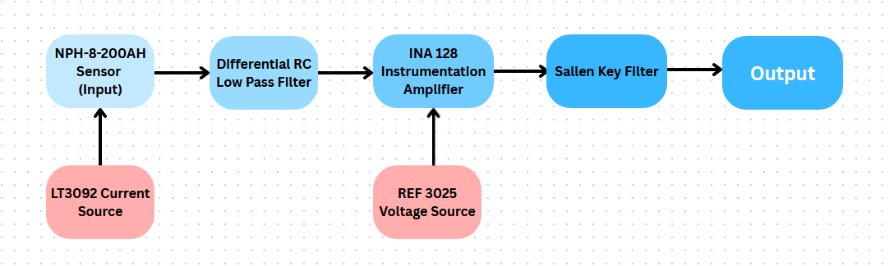
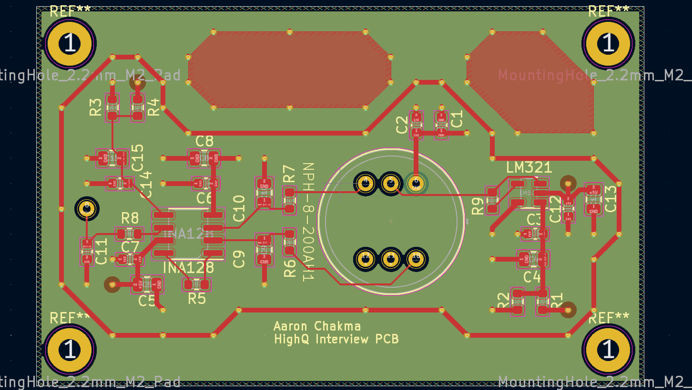

# Pressure Sensor Signal Conditioning PCB

## Overview
A Schematic for the Amphenol NPH-8-200AH pressure sensor for use in aircraft systems. The circuit measures, amplifies, and filters the bridge output of the sensor to produce an analog voltage signal.

Circuit Schematic was designed to withstand noisy RF Radiation, and noise from the power of the plane itself.

## System Architecture

### Assumptions made:
- 5V & 12V Power rails
- Operating Freq ~ 30Hz (Should be sufficent for just pressure readings)

## Signal Chain

### 1. LT3092 Current Source
Current source designed to give consistent excitation current to the NPH-8-200AH
- 50ppm/C, so very temperature resistant
- Iout = 10uA * (Rset/Rout)
- R set = 15K, Rout = 100
- I out = 1.5mA

### 2. Pressue Sensor NPH-8-200AH
  Absolute pressure sensor, 0–200 PSI range
- Wheatstone bridge, 5K internal bridge resistance
  - Needs 7.5V of headroom at 1.5mA
- TO-8 package, through-hole, no bottom cylinder
- Powered via 1.5 mA constant current
- Outputs ~ 100 mV differential at 1.5 mA when excited with 10V

### 3. Input Differential RC Low Pass Filter
  Low-pass filter on differential input lines before going into the INA for RF and EMI protection
- Common Mode Cutoff frequency ~10KHz
- Differential Mode Cutoff frequency ~470Hz
- Important to have the differential cap because ceramic capacitors have up to 20% tollerance, so because the diff cap is significantly larger, it dominates and hides any discrepancies.
- R7 = R6 = 10K, C9 = C10 = 1.6nF, C18 = 16nF

### 4. REF3012 Voltage source
  Provides reference voltage to INA128 allowing us to bias the signal to 1.25V
- 50ppm/C
- Source maintains a voltage of 1.25V even through supply voltage fluctuations
- Very low output impedance
- Highly Temperature stable 

### 5. Instrumentation Amplifier, INA128
  Amplifies differential Wheatstone bridge output
- Gain set by R_G(1.6K) (pins 1 and 8): G = 1 + 50K/ 1.6K ≈ 31
- R_G value: 1.6KΩ
- REF pin set to 1.25V via REF 3012 Voltage source

### 6. Output Sallen Key Filter
  OPA188 based Sallen Key Low-pass filter after amplification
- Cutoff frequency: 40 Hz
- Due to second order falloff, provides attenuation of 40dB at 400 Hz 
- Important to block out 400Hz, because that's the frequency of Airplane AC power

## Key Design Decisions
At every point where I need to ground a component, or connect it to power, I have **Bypass Capacitors**(100nF, 10uF) to store some power, as well as preventing unwanted AC noise from the circuit.

I also installed **Ferrite Beads** to further prevent any high frequency noise from entering the circuit through the power connections.

---
---
---

# **Archive** Not relevant to current schematic, but still cool

This is archived because I unfortunately made changes to the schematic post layout in PCB

Noteable Features:
- Grounded Copper Ring surrounding circuit to protect from EMI
- Grounded Copper pours on empty space to further protect from EMI, and also to dissapate heat
- Power lines are 0.5mm and signal lines are 0.25mm
- Mounting holes are grounded to prevent further EMI, If it were to be put into production, I reccomend some kind of rubber spacer to absorb shock from the vibrations of the plane.

Noteable differences: 
- Instead of using Salen Key Filter, I used passive RC filter.
- Instead of Current Source module, I use op-amp to supply current
- Instead of Voltage Source, I used voltage divider to set Vref of the INA.

## PCB Layout
### Layer Stackup (4-layer)
| Layer | Function |
|-------|----------|
| F.Cu (Top) | Components and primary signal routing |
| In1.Cu | Solid ground plane |
| In2.Cu | Solid +5V power plane |
| B.Cu (Bottom) | Nothing |

### Noise Mitigation
- Ground plane on In1.Cu provides continuous return path and shielding
- Guard ring on F.Cu surrounds entire analog circuit, stitched to ground plane with vias
- Grounded copper fill in all empty board areas
- Input RC filter rejects RF before amplification
- Output RC filter rejects 400 Hz aircraft switching noise
- Sensitive signal traces kept narrow (0.2mm) to minimise parasitic capacitance
- Current hungry power traces kept wide (0.5mm) to maximize efficiency

### Component Selection
- All passives SMD 0603 for compactness and low parasitics
- X7R dielectric for bypass caps — stable across −40°C to 125°C
- Low TCR sense resistor (R9) for current accuracy across temperature
- INA128 Instrument Amplifier
- LM321 op-amp

